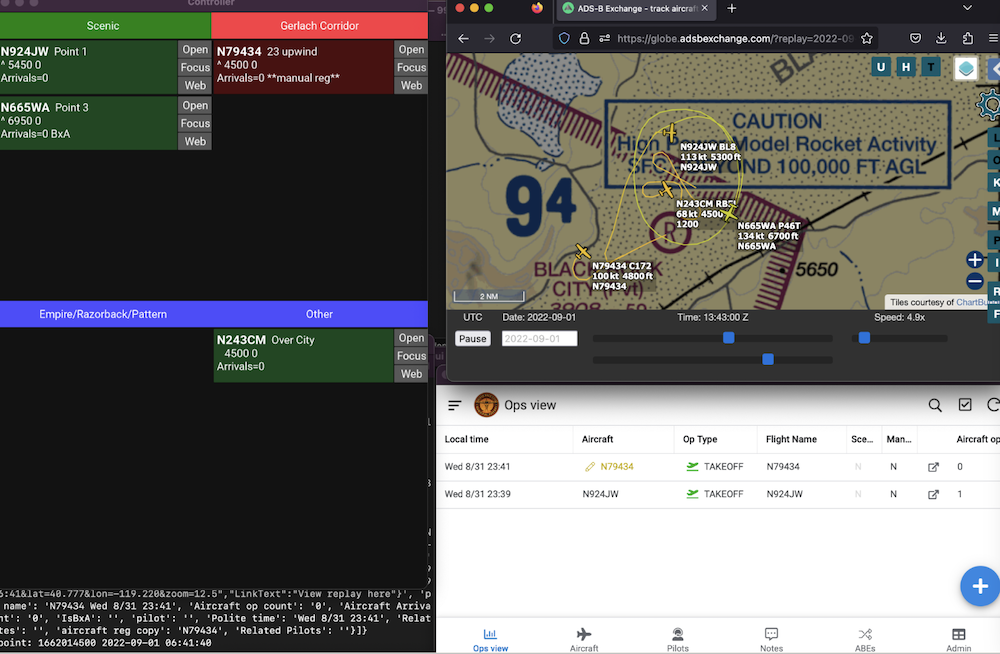
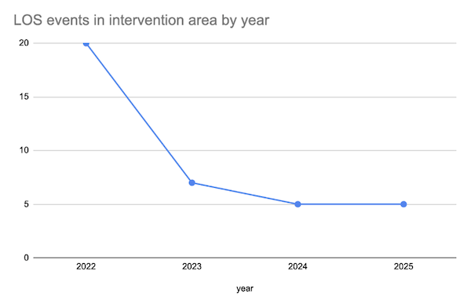
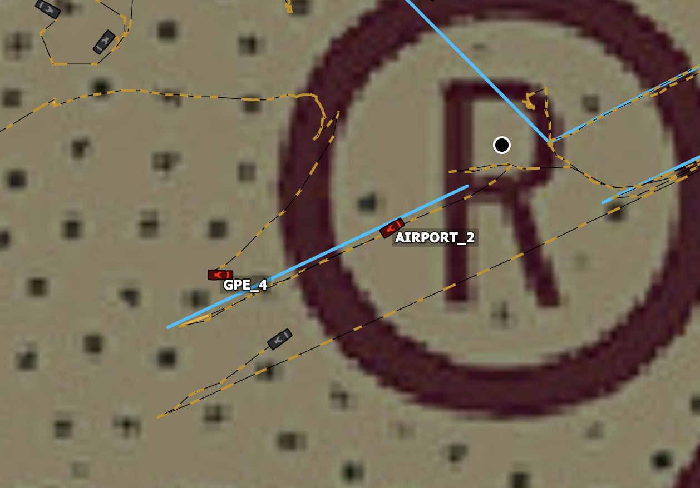

# Gallery

## Integrated ATC tower display
(running airport_quickstart.py, as described at the top of the  will launch most of this, at the airport of your choice)

## Analysis of Loss-Of-Separation events
This work led to a 70% reduction in hazardous events at 88NV. [More info](https://docs.google.com/presentation/d/1MmJo9PRTCp6p1L1bjh9WwiDgDa_Yue9ch7kSMMmup3Q/edit?slide=id.p#slide=id.p)

## Meshtastic-driven ground vehicle tracking and runway alerts
Using , ground vehicle locations
can be injected into the readsb data stream, allowing them to be visualized and
analyzed with tar1090 and all the tools in this project.

