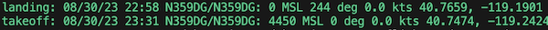

# Quick Airport Setup

Want to monitor traffic at your local airport? This script generates all the config files you need in one step.




## Usage

```bash
source .venv/bin/activate
python3 src/tools/generate_airport_config.py KPAO
```

Replace `KPAO` with your airport's ICAO code. The script will:

1. Download airport and runway data from [OurAirports](https://ourairports.com/)
2. Generate a KML file with four monitoring regions
3. Generate YAML config files for rules and stripview
4. Print ready-to-run command lines

## Generated Regions

The script creates four regions based on your airport's longest runway:

| Region | Description |
|--------|-------------|
| **Departure** | 3nm wedge extending from runway end, ±25° from runway heading |
| **Approach** | 5nm wedge extending from runway end, ±30° from runway heading |
| **Ground** | 1.5nm circle around the airport |
| **Vicinity** | 10nm circle around the airport |

Altitudes are automatically adjusted for your airport's field elevation.

## Options

```bash
# Use a specific runway instead of the default
python3 src/tools/generate_airport_config.py KPAO --runway 31
```

By default, the script picks the lower-numbered end of the longest runway (e.g., runway 13 instead of 31). Use `--runway` to override this.

## Example Output

```
$ python3 src/tools/generate_airport_config.py KPAO --runway 31

Looking up KPAO...
  Palo Alto Airport
  Elevation: 4 ft MSL
  Location: 37.4611, -122.1150
  Runways: 1
  Using runway: 31 (length: 2443 ft)
  Approach end: 37.4585, -122.1120
  Departure end: 37.4638, -122.1180
  Heading: 322°

Generating files...
  examples/generated/kpao_regions.kml
  examples/generated/kpao_rules.yaml
  examples/generated/kpao_stripview.yaml

================================================================================
Generated files for KPAO (Palo Alto Airport, elev 4ft)
================================================================================

VIEW IN GOOGLE EARTH:
  Open examples/generated/kpao_regions.kml to verify regions look correct

RUN STRIPVIEW (no hardware required - uses airplanes.live API):
  python3 src/applications/stripview/controller.py \
    -- --api --rules examples/generated/kpao_stripview.yaml

RUN AIRPORT MONITOR / LOS DETECTION (no hardware required - uses airplanes.live API):
  python3 src/applications/tcp_api_monitor/monitor.py \
    examples/generated/kpao_rules.yaml
```

## How It Works

The script fetches data from OurAirports, which provides international airport and runway information including precise endpoint coordinates. This data is cached locally in `src/tools/.cache/` so subsequent runs are faster.

The KML regions are ordered so that more specific regions (Departure, Approach) take precedence over general ones (Ground, Vicinity) when an aircraft is in multiple regions.

## Customization

The generated files are a starting point. You can edit them to:

- Adjust region sizes by modifying the KML coordinates
- Add additional rules in the YAML files
- Change altitude thresholds
- Add Slack notifications or other actions

See [RULE_SCHEMA.yaml](RULE_SCHEMA.yaml) for all available conditions and actions.
